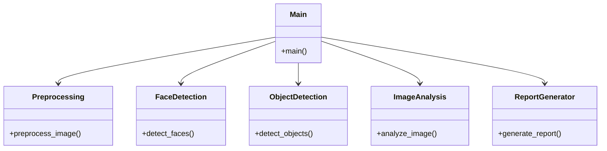

```mermaid
classDiagram
class Main {
+main()
}
class Preprocessing {
+preprocess_image()
}
class FaceDetection {
+detect_faces()
}
class ObjectDetection {
+detect_objects()
}
class ImageAnalysis {
+analyze_image()
}
class ReportGenerator {
+generate_report()
}
Main --> Preprocessing
Main --> FaceDetection
Main --> ObjectDetection
Main --> ImageAnalysis
Main --> ReportGenerator
```