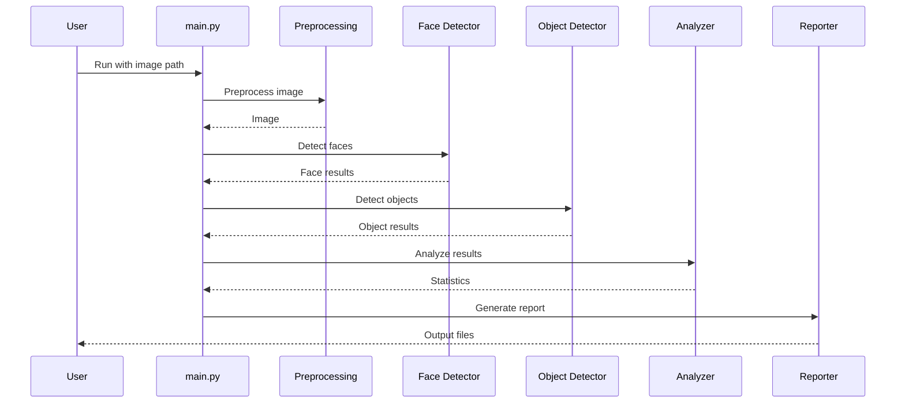

```mermaid
sequenceDiagram
participant U as User
participant M as main.py
participant P as Preprocessing
participant F as Face Detector
participant O as Object Detector
participant A as Analyzer
participant R as Reporter
U->>M: Run with image path
M->>P: Preprocess image
P-->>M: Image
M->>F: Detect faces
F-->>M: Face results
M->>O: Detect objects
O-->>M: Object results
M->>A: Analyze results
A-->>M: Statistics
M->>R: Generate report
R-->>U: Output files
```