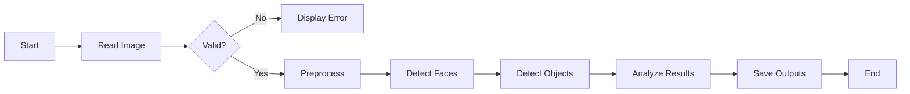

```mermaid
flowchart LR
A[Start] --> B[Read Image]
B --> C{Valid?}
C -- No --> D[Display Error]
C -- Yes --> E[Preprocess]
E --> F[Detect Faces]
F --> G[Detect Objects]
G --> H[Analyze Results]
H --> I[Save Outputs]
I --> J[End]
```